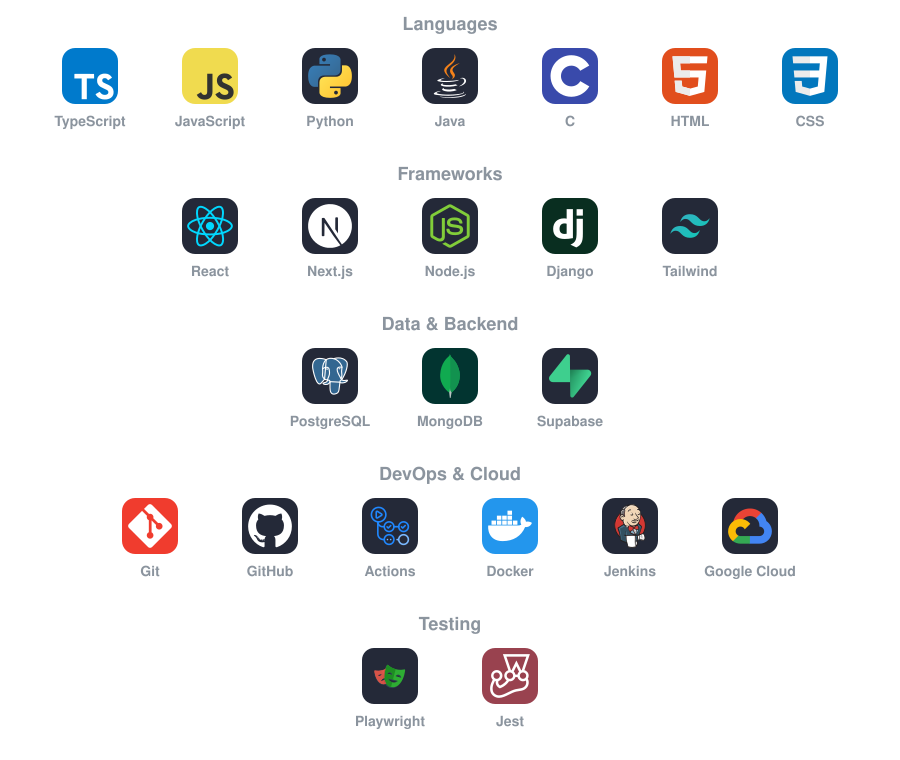

 

### 👋 Hi, I'm Harshit

I enjoy building products that combine strong software engineering, thoughtful user experiences and practical applications of AI.

 

## ✦ Projects

<table>
<tr><td width="50%" valign="top" align="center"><h3 align="center">🚗 TraCar</h3>
A smart vehicle management application designed to help drivers keep track of NCT, insurance, motor tax, fuel and servicing.

&nbsp;&nbsp;&nbsp;&nbsp;

<a href="https://github.com/Artemis-Coder17/TraCar">View repository →</a>
</td><td width="50%" valign="top" align="center"><h3 align="center">🤖 PitchPerfect</h3>
An AI-powered pitching assistant built at HackIreland to help users improve their pitches and prepare for investor and judge questions.

&nbsp;&nbsp;&nbsp;

<a href="https://github.com/LMol-4/PitchPerfect">View repository →</a>
</td></tr>
<tr><td width="50%" valign="top" align="center"><h3 align="center">📱 AskUp</h3>
An anonymous student Q&A platform designed for live classroom interaction, including questions, upvotes and lecturer engagement.

&nbsp;&nbsp;

<a href="https://github.com/TU856-MSD-25/askUp">View repository →</a>
</td><td width="50%" valign="top" align="center"><h3 align="center">🐜 Anterric</h3>
A team-developed action-adventure game built with Godot and GDScript.

🏆 <b>Games Fleadh — Best Game Built Using a Game Engine</b>

&nbsp;&nbsp;

<a href="https://github.com/OsmanAlec/Anterric">View repository →</a>
</td></tr>
<tr><td width="50%" valign="top" align="center"><h3 align="center">🏓 PingScore</h3>
A browser-based table tennis scoring application with match logic, serve tracking, tournament modes and voice interaction.

&nbsp;&nbsp;

<a href="https://github.com/Artemis-Coder17/ping-score">View repository →</a>
</td><td width="50%" valign="top" align="center"><h3 align="center">🎯 Wordle Solver</h3>
A Python-based Wordle solver exploring algorithmic problem solving and candidate-word filtering.

&nbsp;

<a href="https://github.com/Artemis-Coder17/Wordle-Solver">View repository →</a>
</td></tr>
</table>

 

 

## ✦ Tech Stack

<h4 align="center">Platforms</h4>

&nbsp;&nbsp;

<h4 align="center">AI</h4>

&nbsp;&nbsp;&nbsp;&nbsp;&nbsp;

 

## 🌍 Open-source contributions

| Repository | About |
|---|---|
| [**SAP/open-ux-tools**](https://github.com/SAP/open-ux-tools) | Libraries and generators behind SAP Fiori tools |
| [**SAP/inquirer-gui**](https://github.com/SAP/inquirer-gui) | Graphical UI for rendering Inquirer prompts in Yeoman generators |
| [**SAP/app-studio-toolkit**](https://github.com/SAP/app-studio-toolkit) | Toolkit of extensions for SAP Business Application Studio |
| [**SAP/ui5-language-assistant**](https://github.com/SAP/ui5-language-assistant) | VS Code language support for UI5 and SAP Fiori development |

 

Thanks for stopping by.

